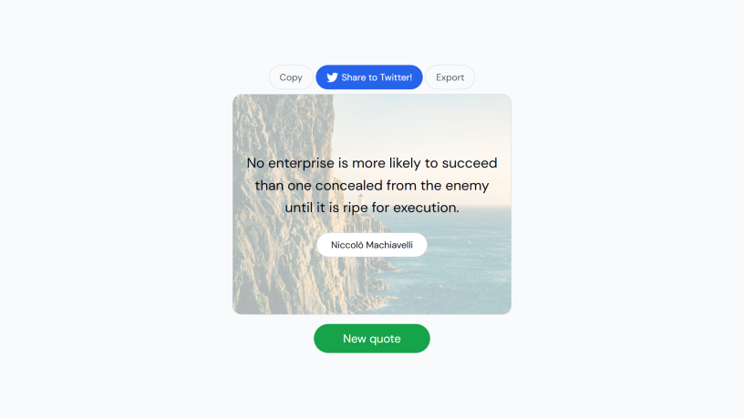

# Quote Genarator Application

## Features

- Fetch a random quote from the API.
- Display the quote and author on the page.
- Add a "New Quote" button to fetch another quote.
- Implement a copy to clipboard button.
- Add a share on Twitter button.
- Add a "Export" button to save the quote image to user computer.
- Set a random background image behind the quote.

## Screenshots

## Deployment Link
[Live Demo](https://quote-generator-yh6r.onrender.com)

## How to Use
Generate a Quote: Click the "New quote" button to view a random quote and its author.
Export the Quote: Use the "Export" button to download the quote as a text file.
Share the Quote: Share the displayed quote on social media using the "Share on Twitter" button.
Copy the Quote: Click the "Copy" button to copy the quote to your clipboard for easy sharing.

## Installation
Clone the repository:
git clone https://github.com/your-username/mood-tracker.git
Open index.html in a browser.
Start tracking your moods!

### Technologies Used
- HTML
- CSS
- JavaScript

## Contributing
Feel free to submit issues or pull requests to improve the application.

## License
This project is open-source and available under the [MIT License](LICENSE).
